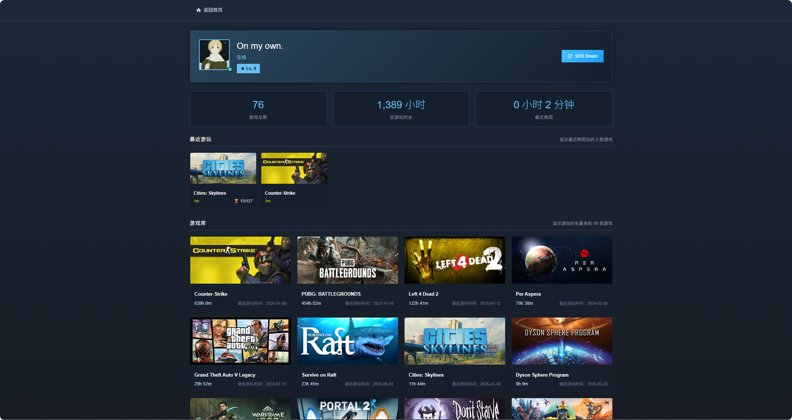

# Steam 信息展示插件

在 Halo 博客中展示 Steam 用户资料、游戏库、最近游玩记录和徽章信息。



## 功能特性

- 展示 Steam 用户资料（头像、昵称、在线状态、等级、上次在线时间）
- 展示游戏库列表（支持分页、按游玩时长排序）
- 展示最近游玩的游戏（可选显示成就进度）
- 展示统计数据（游戏总数、总游玩时长、最近两周游玩时长）
- 展示徽章信息（徽章列表、经验值、等级进度）
- 数据缓存机制，减少 API 调用
- 支持 Steam API 代理配置
- 支持自定义图片 CDN 加速
- 提供独立的 Steam 页面（`/steam`）
- 提供 Finder API，方便主题集成
- 提供 REST API，支持前端异步获取数据

## 安装

1. 下载最新版本的 JAR 文件
2. 在 Halo 后台 → 插件 → 安装插件
3. 上传 JAR 文件并启用插件

## 配置

### 基本配置

1. 获取 Steam API Key：访问 [Steam 开发者页面](https://steamcommunity.com/dev/apikey)
2. 获取 Steam ID：17位数字格式（如 `76561198000000000`）
3. 在 Halo 后台 → 插件 → Steam 信息展示 → 设置 中填写配置
4. 点击「验证配置」确认 API Key 和 Steam ID 有效

### 页面配置

- **页面标题**：Steam 页面的标题
- **每页显示数量**：游戏库分页每页显示的游戏数量
- **游戏库总数量限制**：最多显示的游戏数量（按游玩时长排序），设为 0 则不限制
- **最近游玩显示数量**：最近游玩区域显示的游戏数量
- **显示最近游玩成就进度**：开启后显示成就完成进度（会增加加载时间）
- **点击游戏卡片跳转 Steam 商城**：开启后点击游戏卡片跳转到 Steam 商城页面
- **包含免费游戏**：开启后游戏库会包含玩过的免费游戏（如 CS2、Dota 2 等）

### 代理配置

如果服务器无法直接访问 Steam API，可以配置代理：

- **HTTP 代理**：配置代理主机和端口
- **自定义 API 地址**：使用第三方 Steam API 代理服务

## 使用方式

### 访问 Steam 页面

插件安装后，访问 `/steam` 即可查看 Steam 信息页面。

### 主题集成（Finder API）

在主题模板中使用 `steamFinder` 获取数据：

```html
<!-- 获取用户资料 -->
<div th:with="profile=${steamFinder.getProfile()}">
    <span th:text="${profile?.summary?.personaName}">用户名</span>
</div>

<!-- 获取最近游玩 -->
<div th:each="game : ${steamFinder.getRecentGames(5)}">
    <span th:text="${game.name}">游戏名</span>
</div>

<!-- 获取游戏库（分页） -->
<div th:with="games=${steamFinder.getOwnedGames(1, 12)}">
    <div th:each="game : ${games.items}">
        <span th:text="${game.name}">游戏名</span>
    </div>
</div>

<!-- 获取统计数据 -->
<div th:with="stats=${steamFinder.getStats()}">
    <span th:text="${stats.totalGames}">游戏总数</span>
</div>

<!-- 获取徽章信息 -->
<div th:with="badges=${steamFinder.getBadges()}">
    <span th:text="${badges.totalBadges}">徽章总数</span>
    <span th:text="${badges.playerXp}">总经验值</span>
    <span th:text="${badges.playerLevel}">等级</span>
</div>
```

### REST API

#### 获取用户资料

```
GET /apis/api.steam.halo.run/v1alpha1/profile
```

响应示例：
```json
{
  "summary": {
    "steamId": "76561198000000000",
    "personaName": "用户名",
    "profileUrl": "https://steamcommunity.com/id/xxx/",
    "avatarFull": "https://avatars.steamstatic.com/xxx_full.jpg",
    "personaState": 1,
    "lastLogoff": 1704700000
  },
  "steamLevel": 50,
  "statusText": "在线",
  "playing": false
}
```

#### 获取游戏库

```
GET /apis/api.steam.halo.run/v1alpha1/games?page=1&size=20&sortBy=playtime_forever
```

参数：
- `page`：页码，默认 1
- `size`：每页数量，默认 12，最大 100
- `sortBy`：排序方式，`playtime_forever`（游玩时长）或 `name`（名称）

响应示例：
```json
{
  "page": 1,
  "size": 20,
  "total": 150,
  "items": [
    {
      "appId": 730,
      "name": "Counter-Strike 2",
      "playtimeForever": 12000,
      "playtimeFormatted": "200 小时",
      "headerImageUrl": "https://cdn.cloudflare.steamstatic.com/steam/apps/730/header.jpg",
      "lastPlayedFormatted": "2025-01-08"
    }
  ]
}
```

#### 获取最近游玩

```
GET /apis/api.steam.halo.run/v1alpha1/recent?limit=5
```

参数：
- `limit`：返回数量，默认使用配置值

响应示例：
```json
[
  {
    "appId": 730,
    "name": "Counter-Strike 2",
    "playtime2Weeks": 120,
    "playtime2WeeksFormatted": "2 小时",
    "headerImageUrl": "https://cdn.cloudflare.steamstatic.com/steam/apps/730/header.jpg"
  }
]
```

#### 获取统计数据

```
GET /apis/api.steam.halo.run/v1alpha1/stats
```

响应示例：
```json
{
  "totalGames": 150,
  "totalPlaytimeMinutes": 120000,
  "totalPlaytimeFormatted": "2000 小时",
  "recentPlaytimeMinutes": 600,
  "recentPlaytimeFormatted": "10 小时"
}
```

#### 获取游戏成就进度

```
GET /apis/api.steam.halo.run/v1alpha1/achievements/{appId}
```

参数：
- `appId`：游戏 ID

响应示例：
```json
{
  "appId": 730,
  "gameName": "Counter-Strike 2",
  "achievedCount": 50,
  "totalAchievements": 167
}
```

#### 获取徽章信息

```
GET /apis/api.steam.halo.run/v1alpha1/badges
```

响应示例：
```json
{
  "badges": [...],
  "totalBadges": 25,
  "playerXp": 5000,
  "playerLevel": 50,
  "xpNeededToLevelUp": 100,
  "levelProgressPercent": 80
}
```

## 开发

```bash
# 克隆项目
git clone https://github.com/Tim0x0/steam.git
cd steam

# 启用插件开发服务器
./gradlew haloServer
```

## 构建

```bash
./gradlew build
```

构建完成后，可以在 `build/libs` 目录找到插件 JAR 文件。

## 环境要求

- Halo >= 2.22.1
- JDK 21

## 许可证

[GPL-3.0](./LICENSE) © [Tim0x0](https://github.com/Tim0x0/)

## 作者

**[Tim](https://blog.timxs.com)**