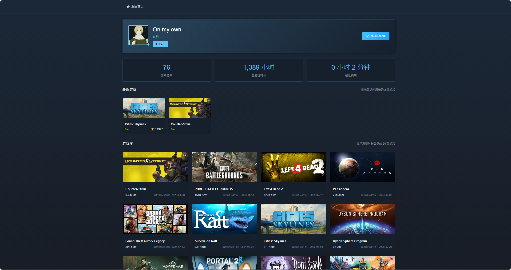

<div align="center">

# 🎮 Steam 信息展示插件

**在你的 Halo 博客中优雅地展示 Steam 游戏生涯**

用户资料 · 游戏库 · 最近游玩 · 徽章成就 · 游戏时长热力图 · 富文本游戏卡片

<br>

[](https://github.com/Tim0x0/halo-plugin-steam/releases)
[](https://github.com/Tim0x0/halo-plugin-steam/blob/main/LICENSE)
[](https://www.halo.run)
[](https://openjdk.org/projects/jdk/21/)

📖 [使用教程](docs/usage-guide.md) &nbsp;|&nbsp; 📡 [Steam API 技术参考](docs/steam-api-reference.md) &nbsp;|&nbsp; 🎮 [在线演示](https://blog.timxs.com/steam)

<br>



</div>

---

## ✨ 项目简介

这是一个 [Halo 2.x](https://www.halo.run) 插件，让你在个人博客中展示完整的 Steam 游戏生涯。

它不仅提供开箱即用的 `/steam` 独立页面，还开放了 **Finder API**（主题模板集成）与 **REST API**（前端异步加载），并内置 **富文本编辑器游戏卡片扩展**——在写文章时插入一个 App ID，即可渲染出带封面、简介、价格的游戏卡片。

为了应对 Steam 官方接口在国内访问慢、新游戏封面/名称缺失等问题，插件设计了**后台定时预热缓存**、**官方商店接口数据补全**和**图片 CDN 加速**等机制，开箱即可获得流畅、稳定的展示体验。

## 📑 目录

- [功能特性](#-功能特性)
- [快速开始](#-快速开始)
- [配置说明](#️-配置说明)
- [使用方式](#-使用方式)
  - [独立页面](#1-独立-steam-页面)
  - [主题集成（Finder API）](#2-主题集成finder-api)
  - [REST API](#3-rest-api)
  - [游戏时长热力图](#4-游戏时长热力图)
  - [富文本游戏卡片](#5-富文本游戏卡片)
- [工作原理](#-工作原理)
- [技术架构](#-技术架构)
- [开发与构建](#-开发与构建)
- [常见问题](#-常见问题)
- [环境要求](#-环境要求)
- [贡献](#-贡献)
- [许可证](#-许可证)

## 🌟 功能特性

### 数据展示
- **用户资料** — 头像、昵称、在线状态、Steam 等级、上次在线时间
- **游戏库** — 分页浏览，按游玩时长排序，支持隐藏指定游戏、限制显示数量
- **最近游玩** — 最近两周的游戏，可选显示成就进度，自动标识「库外游戏」（已退款、转区或不在当前游戏库中）
- **统计数据** — 游戏总数、累计游玩时长、最近两周时长
- **徽章系统** — 徽章列表、经验值、等级进度，支持为系统徽章配置自定义图片
- **游戏时长热力图** — 类 GitHub 贡献墙的日历热力图，4 种配色主题，可视化每日游戏投入

### 体验优化
- 🔥 **后台定时预热** — 数据由后台定时拉取，页面只读缓存，**秒开、不受 Steam 接口波动影响**
- 🛡️ **失败降级** — 拉取失败自动保留上一次的有效数据，避免页面空白
- 🖼️ **真实封面/名称补全** — 通过 Steam 官方商店接口补全新游戏缺失的封面与本地化名称
- 🌐 **代理支持** — HTTP 代理 / 自定义 API 反代地址，解决国内服务器访问问题
- 🚀 **图片加速** — 封面、图标、头像统一域名替换，接入自有 CDN 加速

### 开发者友好
- 🧩 **富文本游戏卡片扩展** — 编辑文章时插入 App ID 即展示游戏信息卡片，支持 7 种语言与暗色模式
- 🎨 **Finder API** — 在主题模板中通过 `steamFinder` 直接取数据
- 🔌 **REST API** — 公开接口支持前端异步加载，管理接口支持缓存刷新与数据追踪
- ✅ **优雅的错误处理** — 所有接口失败时优雅降级，不破坏页面渲染

## 🚀 快速开始

### 安装插件

1. 前往 [Releases](https://github.com/Tim0x0/halo-plugin-steam/releases) 下载最新的 JAR 文件
2. 在 Halo 后台进入 **插件 → 安装插件**
3. 上传 JAR 文件并启用插件

### 三步配置

1. **获取 Steam API Key** — 访问 [Steam 开发者页面](https://steamcommunity.com/dev/apikey) 注册获取
2. **获取 Steam ID** — 17 位数字格式（如 `76561198000000000`），可用 [SteamID.io](https://steamid.io/) 查询
3. **填写并验证** — 在 **插件 → Steam 信息展示 → 设置** 中填入，点击「验证配置」确认有效

> ⚠️ 请务必将 Steam 个人资料的 **「我的个人资料」** 和 **「游戏详情」** 隐私设置为 **公开**，否则无法获取游戏库与成就数据。

完成后访问 `https://你的域名/steam` 即可看到 Steam 页面。

## ⚙️ 配置说明

插件配置分为 6 个分组，下表为常用项。完整说明请见 **[使用教程](docs/usage-guide.md)**。

| 分组 | 关键配置 | 说明 |
| --- | --- | --- |
| **基本配置** | Steam API Key / Steam ID | 必填，插件运行的前提 |
| | 活跃信息刷新间隔 | 后台预热「资料 + 最近游玩」的间隔（默认 10 分钟） |
| | 库藏信息刷新间隔 | 后台预热「游戏库 + 徽章」的间隔（默认 60 分钟） |
| | 缓存过期时间 / API 超时 | 按需查询缓存时长 / 后台拉取超时（5–60 秒） |
| **页面配置** | 页面标题、每页数量、数量限制 | 控制 `/steam` 页面的展示 |
| | 显示成就进度、跳转商城、包含免费游戏、隐藏游戏 | 展示行为开关 |
| **徽章配置** | 系统徽章图片映射 | 为系统徽章配置自定义图片（Badge ID → 图片 URL） |
| **统计（热力图）** | 启用时长追踪、保留天数 | 开启后台游戏时长记录 |
| | 显示热力图、天数、配色主题、图例、ECharts 地址 | 热力图前端展示 |
| **编辑器配置** | 暗色模式选择器、游戏显示语言 | 游戏卡片的主题适配与语言 |
| **代理配置** | API 代理（HTTP / 自定义地址） | 解决服务器无法直连 Steam 的问题 |
| | 图片加速（图标模板、加速域名） | 接入 CDN 加速 Steam 图片 |

## 📚 使用方式

### 1. 独立 Steam 页面

插件启用后，访问 `/steam` 即可看到内置的 Steam 信息页面，包含资料卡片、统计数据、热力图、最近游玩与游戏库。

### 2. 主题集成（Finder API）

在主题模板中使用 `steamFinder` 获取数据：

```html
<!-- 用户资料 -->
<th:block th:with="profile=${steamFinder.getProfile()}">
    <div th:if="${profile != null}">
        
        <span th:text="${profile.summary?.personaName}">用户名</span>
        <span th:text="${profile.statusText}">在线状态</span>
        <span th:text="'等级 ' + ${profile.steamLevel}">等级</span>
    </div>
</th:block>

<!-- 最近游玩 -->
<th:block th:with="recentGames=${steamFinder.getRecentGames(5)}">
    <div th:if="${recentGames != null}" th:each="game : ${recentGames}">
        <!-- headerImageUrl 可能为 null（封面缺失），需判空兜底占位图 -->
        
        <span th:text="${game.name}">游戏名</span>
        <span th:text="${game.playtime2WeeksFormatted}">游玩时长</span>
    </div>
</th:block>

<!-- 游戏库（分页） -->
<th:block th:with="games=${steamFinder.getOwnedGames(1, 12)}">
    <div th:if="${games != null}" th:each="game : ${games.items}">
        <span th:text="${game.name}">游戏名</span>
    </div>
</th:block>
```

| 方法 | 返回类型 | 说明 |
| --- | --- | --- |
| `getProfile()` | `SteamProfile` | 用户资料 |
| `getRecentGames(limit)` | `List<RecentGame>` | 最近游玩 |
| `getOwnedGames(page, size)` | `ListResult<OwnedGame>` | 游戏库（分页） |
| `getStats()` | `SteamStats` | 统计数据 |
| `getBadges()` | `BadgeInfo` | 徽章信息 |

> ⚠️ Finder API 在请求失败时返回 `null`，请在模板中做判空处理。完整字段与示例见 **[主题集成文档](docs/usage-guide.md)**。

### 3. REST API

公开接口无需认证，基础路径 `/apis/api.steam.timxs.com/v1alpha1`：

| 接口 | 方法 | 说明 |
| --- | --- | --- |
| `/profile` | GET | 获取用户资料 |
| `/games?page=1&size=20&sortBy=playtime_forever` | GET | 获取游戏库（分页、排序） |
| `/recent?limit=5` | GET | 获取最近游玩 |
| `/stats` | GET | 获取统计数据 |
| `/achievements/{appId}` | GET | 获取指定游戏成就进度 |
| `/badges` | GET | 获取徽章信息 |
| `/game-detail/{appId}?lang=schinese` | GET | 获取游戏详情（用于游戏卡片） |
| `/heatmap/records?startDate=&endDate=` | GET | 获取每日游戏时长记录 |

<details>
<summary>📦 点击展开响应示例</summary>

**获取用户资料** `GET /profile`

```json
{
  "summary": {
    "steamId": "76561197960435530",
    "personaName": "TimOxO",
    "profileUrl": "https://steamcommunity.com/id/timoxo/",
    "avatar": "https://avatars.steamstatic.com/xxx.jpg",
    "avatarMedium": "https://avatars.steamstatic.com/xxx_medium.jpg",
    "avatarFull": "https://avatars.steamstatic.com/xxx_full.jpg",
    "personaState": 1,
    "gameExtraInfo": "Counter-Strike 2",
    "gameId": 730,
    "lastLogoff": 1719190800
  },
  "steamLevel": 42,
  "statusText": "正在游玩: Counter-Strike 2",
  "playing": true
}
```

**获取游戏库** `GET /games?page=1&size=20`

```json
{
  "page": 1,
  "size": 20,
  "total": 150,
  "items": [
    {
      "appId": 730,
      "name": "Counter-Strike 2",
      "playtimeForever": 12000,
      "playtimeFormatted": "200h 0m",
      "imgIconUrl": "8a7b8f4c25e5...",
      "iconUrl": "https://cdn.akamai.steamstatic.com/steamcommunity/public/images/apps/730/8a7b8f4c25e5....ico",
      "rtimeLastPlayed": 1736294400,
      "lastPlayedFormatted": "2025-01-08",
      "headerImageUrl": "https://shared.akamai.steamstatic.com/store_item_assets/steam/apps/730/<hash>/header.jpg",
      "realHeaderImage": "https://shared.akamai.steamstatic.com/store_item_assets/steam/apps/730/<hash>/header.jpg",
      "delisted": false
    }
  ]
}
```

> `headerImageUrl` 是应用图片加速域名后的地址；未配置加速时与 `realHeaderImage` 相同，封面缺失时为 `null`，主题应准备占位图。`delisted=true` 只表示 GetItems 明确返回 `visible=false`（当前地区/状态下商店不可见），GetItems 未返回某个 AppID 不会被判为不可用。

**获取最近游玩** `GET /recent?limit=5`

每条记录包含 `/games` 的全部字段，并额外补充最近两周时长、成就进度与库外标识：

```json
[
  {
    "appId": 730,
    "name": "Counter-Strike 2",
    "playtimeForever": 12000,
    "playtimeFormatted": "200h 0m",
    "playtime2Weeks": 120,
    "playtime2WeeksFormatted": "2h 0m",
    "imgIconUrl": "8a7b8f4c25e5...",
    "iconUrl": "https://cdn.akamai.steamstatic.com/steamcommunity/public/images/apps/730/8a7b8f4c25e5....ico",
    "rtimeLastPlayed": 1736294400,
    "lastPlayedFormatted": "2025-01-08",
    "headerImageUrl": "https://shared.akamai.steamstatic.com/store_item_assets/steam/apps/730/<hash>/header.jpg",
    "realHeaderImage": "https://shared.akamai.steamstatic.com/store_item_assets/steam/apps/730/<hash>/header.jpg",
    "delisted": false,
    "achievementProgressText": "15/30",
    "achievementsLocked": false,
    "inLibrary": true
  }
]
```

> `inLibrary=false` 表示最近游玩条目不在当前游戏库缓存中；冷启动或游戏库预热失败时可能暂不标识。`achievementProgressText` 在开启「显示最近游玩成就进度」后随最近游玩缓存一起预热，`achievementsLocked=true` 时为 `null`。

**获取统计数据** `GET /stats`

```json
{
  "totalGames": 150,
  "totalPlaytimeMinutes": 120000,
  "totalPlaytimeFormatted": "2,000 小时",
  "recentPlaytimeMinutes": 600,
  "recentPlaytimeFormatted": "10 小时 0 分钟"
}
```

> 以上为常用接口的响应示例；`/achievements`、`/badges`、`/game-detail` 等接口的完整字段以 Halo 的 OpenAPI（Swagger）文档为准。

</details>

管理接口需管理员权限，基础路径 `/apis/console.api.steam.timxs.com/v1alpha1`：

| 接口 | 方法 | 说明 |
| --- | --- | --- |
| `/verify` | POST | 验证 API Key 与 Steam ID |
| `/refresh` | POST | 刷新缓存并触发后台预热 |
| `/heatmap/track` | POST | 手动触发一次游戏时长追踪 |
| `/heatmap/cleanup` | POST | 手动清理过期热力图数据 |

完整 API 文档见 **[使用教程](docs/usage-guide.md)**。

### 4. 游戏时长热力图

热力图以类似 GitHub 贡献墙的形式，可视化展示你每天的游戏投入：

- 在 **统计** 配置中开启 **「启用游戏时长追踪」**，后台将每小时记录一次游戏时长变化
- 开启 **「在页面显示热力图」** 后即在 `/steam` 页面展示
- 支持 **4 种配色**（Steam 蓝 / GitHub 绿 / 火焰橙 / 紫色梦幻）、自定义天数、颜色图例

> ⚠️ Steam API 不提供历史每日数据，热力图**只能从启用功能后开始记录**。首次启用需等待至少 1 小时产生首个数据点，也可点击「手动追踪时长」立即测试。

### 5. 富文本游戏卡片

在 Halo 文章编辑器中，插件提供了 **Steam 游戏卡片扩展**：输入游戏 App ID 或商店链接，即可渲染出包含封面、简介、开发商、类型、价格、发行日期的游戏卡片；若你拥有该游戏，还会显示个人游玩时长与成就进度。

- **多语言** — 支持简中、繁中、英、日、韩、德、法 7 种语言与对应货币，可自动跟随访客浏览器语言
- **暗色模式** — 自动适配主题暗色模式，支持自定义检测选择器

## 🔧 工作原理

插件的核心设计是 **「后台拉取、前端只读」**，以此获得稳定的访问体验：

```
                        ┌─────────────────────────────┐
   定时心跳（每分钟）  →  │   CacheWarmupScheduler      │
                        │   活跃组：资料 + 最近游玩     │ ──┐
                        │   库藏组：游戏库 + 徽章       │   │ 调用 Steam API
                        └─────────────────────────────┘   │ （含官方商店接口补全封面/名称）
                                      │ 写入                ↓
                                      ▼              ┌──────────────┐
   前端页面 / Finder / REST  ──读取──▶  内存缓存  ◀──│  Steam Web API │
                                  （只读，秒开）      └──────────────┘
```

- **双频预热** — 变化快的「活跃信息」与变化慢、数据重的「库藏信息」分别按各自间隔刷新，兼顾实时性与接口压力
- **失败兜底** — 任一次拉取失败时，前端继续读取上一次的有效缓存（`getStale`），并保留旧封面避免被冲掉
- **数据补全** — 新游戏的封面只存在于带哈希的资源路径、无法靠 App ID 拼接，插件通过官方 `IStoreBrowseService/GetItems` 批量补全真实封面与本地化名称

## 🏗 技术架构

```
Controller（API 接口）           Scheduler（定时任务）
  ├─ SteamController            ├─ CacheWarmupScheduler     缓存定时预热
  ├─ SteamConsoleController     └─ PlaytimeTrackingScheduler 时长追踪与清理
  └─ HeatmapController
        │
        ▼
Service（业务逻辑）
  ├─ SteamService              Steam 数据业务
  ├─ SteamSettingService       配置读取（ConfigMap）
  ├─ PlaytimeTrackingService   游戏时长追踪
  └─ CacheService              内存缓存（get / getStale）
        │
        ▼
Client（Steam API 调用）
  └─ SteamApiClient            ISteamUser / IPlayerService / IStoreBrowseService …
```

- **响应式编程** — 基于 Project Reactor，Service 返回 `Mono<T>`，Controller 使用函数式路由
- **自定义资源** — 热力图使用 `PlaytimeSnapshot`（时长快照）与 `DailyPlaytimeRecord`（每日记录）两个 Custom Resource
- **前端扩展** — 游戏卡片编辑器扩展基于 Vue 3 + Rsbuild 构建（`ui/` 目录）

更多技术细节见项目内 `CLAUDE.md` 与 [Steam API 技术参考](docs/steam-api-reference.md)。

## 💻 开发与构建

### 环境

- JDK 21
- Node.js（用于构建前端，推荐通过 [pnpm](https://pnpm.io/) 管理依赖）

### 启动开发服务器

```bash
git clone https://github.com/Tim0x0/halo-plugin-steam.git
cd halo-plugin-steam

# 启动 Halo 插件开发服务器（自动加载插件）
./gradlew haloServer
```

### 构建插件

```bash
./gradlew build
```

构建产物位于 `build/libs/` 目录。构建过程会自动编译 `ui/` 下的前端资源。

### 运行测试

```bash
./gradlew test
```

## ❓ 常见问题

<details>
<summary><b>页面显示「部分 Steam 数据加载失败」？</b></summary>

通常是隐私设置或网络问题：确认 Steam「个人资料」与「游戏详情」均为**公开**；检查 API Key / Steam ID 是否正确；国内服务器请配置代理。

</details>

<details>
<summary><b>修改配置后没有立即生效？</b></summary>

页面列表数据由后台定时预热刷新。修改后可在「基本配置」点击 **「刷新缓存」** 立即生效，或等待下一轮预热。

</details>

<details>
<summary><b>国内服务器无法访问 Steam API / 图片加载慢？</b></summary>

在「代理配置」中启用 **HTTP 代理** 或 **自定义 API 地址**；图片慢则配置 **图片加速域名**，接入自有或第三方 CDN。搭建反代可参考 [Steam API 技术参考](docs/steam-api-reference.md)。

</details>

<details>
<summary><b>热力图没有数据 / 只显示部分日期？</b></summary>

热力图只能记录**开启功能之后**的数据，Steam 不提供历史每日数据。首次开启需等待至少 1 小时，或点击「手动追踪时长」测试。

</details>

更多问题见 **[使用教程](docs/usage-guide.md)**，或在 [Issues](https://github.com/Tim0x0/halo-plugin-steam/issues) 中反馈。

## 📋 环境要求

| 项目 | 要求 |
| --- | --- |
| Halo | >= 2.22.1 |
| JDK | 21 |
| 构建工具 | Gradle |

## 🤝 贡献

欢迎提交 Issue 与 Pull Request！

- 🐛 [报告问题](https://github.com/Tim0x0/halo-plugin-steam/issues)
- 💡 [功能建议](https://github.com/Tim0x0/halo-plugin-steam/issues)
- 🔧 提交 PR 前请确保 `./gradlew test` 通过

## 📄 许可证

[GPL-3.0](./LICENSE) © [Tim0x0](https://github.com/Tim0x0/)

## 👤 作者

**Tim** — [博客](https://blog.timxs.com) · [GitHub](https://github.com/Tim0x0)

<div align="center">
<br>
如果这个插件对你有帮助，欢迎点一个 ⭐ Star 支持一下！
</div>
